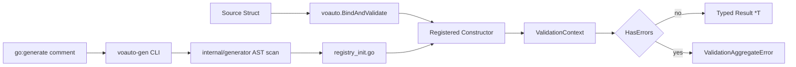
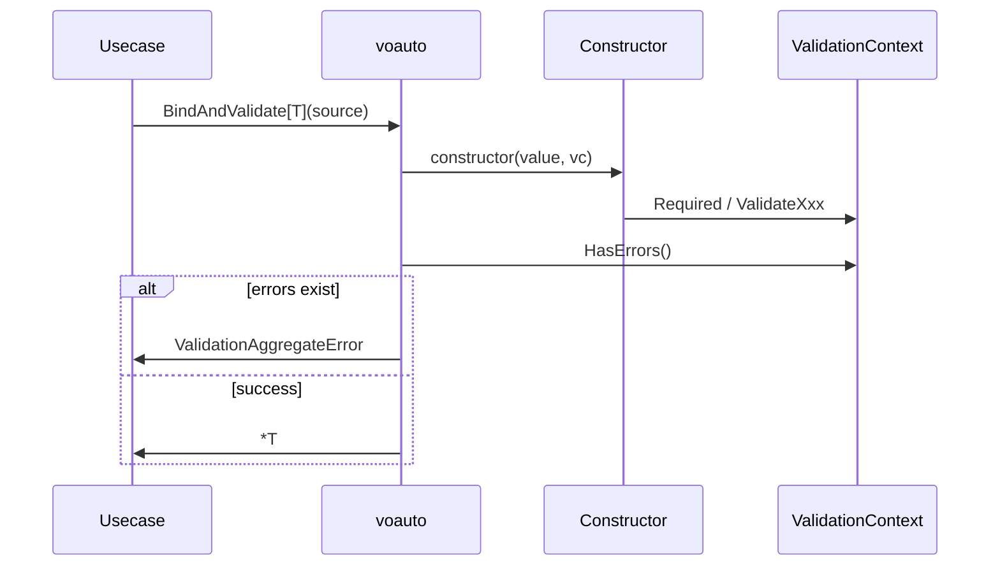

# Design Document

## Overview

本設計は、ValidationContext ライブラリの現行実装を「運用可能な設計情報」として固定化することを目的とする。主な利用者は Go バックエンド開発者であり、任意レイヤーの構造体間変換時に検証・エラー集約・返却を一貫化する。

機能は大きく 3 つの境界で構成される。1 つ目は `validationcontext` パッケージによる検証 API 提供、2 つ目は `voauto` パッケージによる反射ベースのバインド実行、3 つ目は `voauto-gen` と `internal/generator` による登録コード生成である。

### Goals
- 検証エラー集約の API 契約を明確化する
- `voauto` のタグ規約と失敗時挙動をレイヤー非依存で統一する
- 生成フロー（コメント検出から registry 出力まで）を固定する

### Non-Goals
- 新規バリデーションルールの追加
- 永続化層や外部 API 連携
- GUI/CLI の高度な UX 追加

## Architecture

### Existing Architecture Analysis

- 既存コードは機能別ファイル分割（`validate_*.go`）で保守されている
- `voauto` は runtime 反射で構造体間変換を担当する
- `voauto-gen` は build-time に constructor 登録コードを生成する
- テストは `validationcontext_test.go` と `voauto/voauto_test.go` で主要経路を担保する

### Architecture Pattern & Boundary Map

**Architecture Integration**:
- Selected pattern: ライブラリ + 生成ツールの二相アーキテクチャ（実行時と生成時の責務分離）
- Domain/feature boundaries: 検証、バインド、生成を別パッケージへ分離
- Existing patterns preserved: Go 標準慣習（小さな公開 API、テスト同梱、`internal` 隔離）
- New components rationale: なし（現行構成の明文化）
- Steering compliance: `.kiro/steering` に定義した責務境界と一致



### Technology Stack

| Layer | Choice / Version | Role in Feature | Notes |
|-------|------------------|-----------------|-------|
| CLI | Go flag package | `voauto-gen` 引数処理 | 依存最小化 |
| Backend / Library | Go 1.24.3 | 検証 API とバインド API | メイン実装 |
| Data / Storage | なし | 永続化不要 | インメモリのみ |
| Messaging / Events | なし | 非対象 | - |
| Infrastructure / Runtime | Go toolchain | `go test`, `go generate` | CI 実行可能 |

## System Flows



フロー判断は `HasErrors()` のみで分岐し、途中失敗時でも個別エラーを蓄積してからまとめて返す。

## Requirements Traceability

| Requirement | Summary | Components | Interfaces | Flows |
|-------------|---------|------------|------------|-------|
| 1 | 検証エラー集約 | ValidationContext | AddError, HasErrors, AggregateError | Bind/Validate 実行フロー |
| 2 | 組み込み検証 | validate_string/numeric/datetime/network/file | ValidateXxx | Constructor 内検証 |
| 3 | 必須検証 | validate_required | Required | Constructor 内検証 |
| 4 | 自動バインド | voauto | Register, BindAndValidate | 構造体間変換 |
| 5 | 登録コード生成 | cmd/voauto-gen, internal/generator | ScanDirectory, GenerateRegistries | 生成フロー |

## Components and Interfaces

| Component | Domain/Layer | Intent | Req Coverage | Key Dependencies (P0/P1) | Contracts |
|-----------|--------------|--------|--------------|--------------------------|-----------|
| ValidationContext | Core Library | 検証エラー蓄積と集約 | 1,2,3 | runtime, time, net, regexp (P0) | Service |
| voauto | Runtime Binder | 任意構造体間の変換 | 4 | reflect (P0), ValidationContext (P0) | Service |
| voauto-gen CLI | Build Tool | 生成処理起動 | 5 | flag (P0), internal/generator (P0) | Batch |
| generator | Build Tool Internal | AST 解析と registry 生成 | 5 | go/ast, parser, filepath (P0) | Batch |

### Core Library

#### ValidationContext

| Field | Detail |
|-------|--------|
| Intent | 検証エラーを蓄積し、利用者へ集約して返す |
| Requirements | 1, 2, 3 |

**Responsibilities & Constraints**
- `errors []ValidationError` を唯一の状態として保持
- `AddError` でスタックトレース採取を必須化
- 検証メソッドは失敗時のみ `AddError` を呼び出す

**Dependencies**
- Inbound: constructor 関数群 — ドメイン検証呼び出し (Critical)
- Outbound: Go stdlib (`time`, `net`, `regexp`, `os`) — 形式/存在検証 (Critical)

**Contracts**: Service [x] / API [ ] / Event [ ] / Batch [ ] / State [ ]

##### Service Interface
```go
func NewValidationContext() *ValidationContext
func (vc *ValidationContext) AddError(field, message string)
func (vc *ValidationContext) HasErrors() bool
func (vc *ValidationContext) AggregateError() error
func (vc *ValidationContext) Required(value interface{}, field, message string, skipNil bool)
func (vc *ValidationContext) ValidateEmail(value, field, errMsg string)
```
- Preconditions: `vc` が初期化済みであること
- Postconditions: 検証失敗時は `vc.errors` 件数が増える
- Invariants: `errors` は追加専用、削除や上書きを行わない

### Runtime Binder

#### voauto.BindAndValidate

| Field | Detail |
|-------|--------|
| Intent | 任意構造体から型付き結果を生成し、検証失敗を集約エラーで返す |
| Requirements | 4 |

**Responsibilities & Constraints**
- `vctag` 解析（`constructorKey,sourceField`）
- タグ未指定時の `New<Field>` 規約適用
- constructor 未登録時は即時エラー
- 検証エラーあり時は `ValidationAggregateError` を返却

**Dependencies**
- Inbound: 変換元構造体（レイヤー非依存） (Critical)
- Outbound: constructor registry (Critical)
- External: `reflect` (Critical)

**Contracts**: Service [x] / API [ ] / Event [ ] / Batch [ ] / State [ ]

##### Service Interface
```go
type ConstructorFunc func(v any, vc *validationcontext.ValidationContext) any

func Register(key string, constructor ConstructorFunc)
func GetConstructor(key string) ConstructorFunc
func BindAndValidate[T any](source any) (*T, error)
```
- Preconditions: 対象 constructor が事前登録済み
- Postconditions: 成功時は `*T`、失敗時は `error`
- Invariants: constructor map 操作は RWMutex で保護

### Build Tool

#### voauto-gen / generator

| Field | Detail |
|-------|--------|
| Intent | generate コメントから registry 初期化コードを生成 |
| Requirements | 5 |

**Responsibilities & Constraints**
- `_test.go` と既存 `registry_init.go` を除外して走査
- コメント引数（`-output`, `-methods`, `-package`）を解析
- パッケージ単位で出力をまとめる

**Dependencies**
- Inbound: Go ソースファイル群 (Critical)
- Outbound: `registry_init.go` (Critical)

**Contracts**: Service [ ] / API [ ] / Event [ ] / Batch [x] / State [ ]

##### Batch / Job Contract
- Trigger: `go generate ./...` または `voauto-gen -dir <path>`
- Input / validation: Go ファイル、`//go:generate voauto-gen` コメント
- Output / destination: 各 package directory の `registry_init.go`
- Idempotency & recovery: 同入力に対して再生成可能、失敗時は再実行で回復

## Data Models

### Domain Model
- `ValidationContext`（集約ルート）
- `ValidationError`（Field, Message, StackTrace）
- `ValidationAggregateError`（Messages, StackTraces）
- `ConstructorFunc`（入力値 + VC -> 任意型）

### Logical Data Model

**Structure Definition**:
- `ValidationContext.errors` は時系列追加リスト
- `voauto.constructors` は `map[string]ConstructorFunc`
- `vctag` は `"<constructor>[,<sourceField>]"` 形式

**Consistency & Integrity**:
- constructor registry は RWMutex で同時アクセス保護
- `AggregateError` は `errors` スナップショットから生成

### Data Contracts & Integration

**API Data Transfer**
- 形式: Go 関数引数/戻り値
- エラー: 標準 `error` に集約

**Event Schemas**
- 該当なし

## Error Handling

### Error Strategy

- 入力不正は panic ではなく `ValidationContext` へ蓄積
- `BindAndValidate` は constructor 未登録時に即時 `error` を返却
- `AggregateError` により上位レイヤで一括レスポンス生成を可能にする

### Error Categories and Responses

- **User Errors**: 必須未入力、形式不正、範囲外
- **System Errors**: ファイル情報取得失敗など実行環境依存エラー
- **Business Logic Errors**: constructor 内ドメインルール違反（`Required` 等）

### Monitoring

- 最低限は `AggregateError.GetMessages()` をログ出力
- 障害解析時は `GetStackTraces()` を補助情報として利用

## Testing Strategy

### Unit Tests
- `ValidationContext` の `AddError`, `HasErrors`, `FormatErrors`, `AggregateError`
- 各 `ValidateXxx` メソッドの正常/異常
- `Required(skipNil含む)` の境界条件

### Integration Tests
- 複数 constructor での `BindAndValidate` 正常ケース
- constructor 未登録時エラー
- constructor 内検証失敗時の集約エラー返却

### Performance/Load
- `voauto` の反射バインドを大量データで連続実行し、許容範囲を確認
- `AddError` の大量蓄積時メモリ増加を観測
